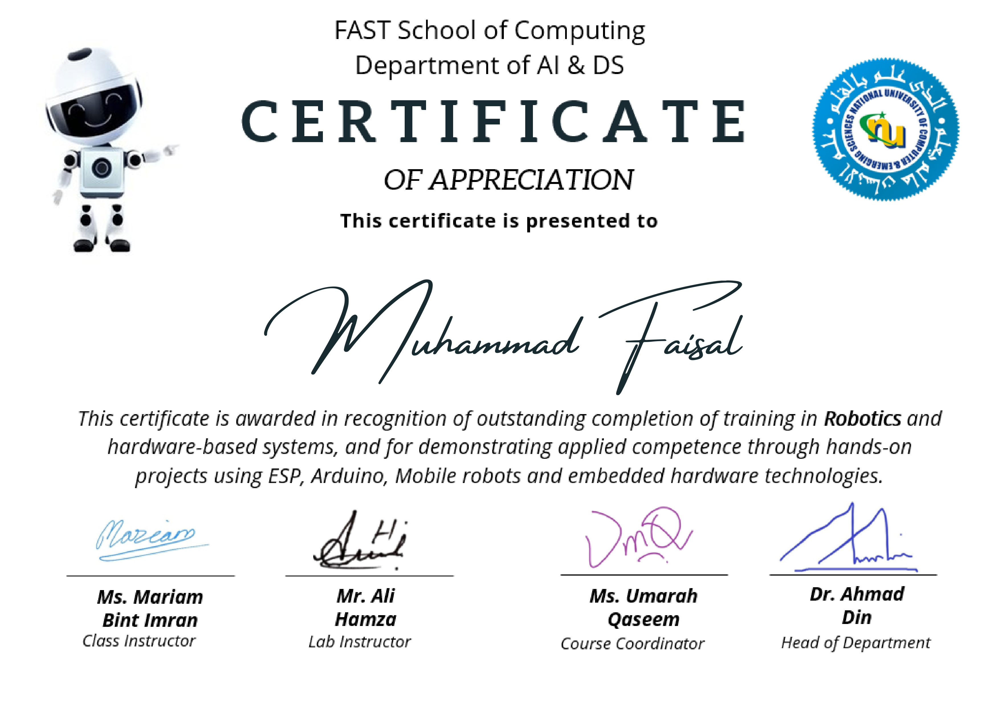

# 📜 Arduino Certification

This repository showcases my **Arduino Certification**, highlighting my knowledge and practical experience in embedded systems and microcontroller-based development.

It represents my understanding of:
- Embedded systems  
- Microcontroller programming  
- Hands-on electronics projects using Arduino  

---

## 🧠 Skills Gained

- Basics of microcontrollers and embedded systems  
- Arduino IDE setup and usage  
- Writing and uploading Arduino sketches (C/C++)  
- Working with digital and analog I/O  
- Interfacing sensors and actuators  
- Serial communication  
- Basic electronics (resistors, LEDs, circuits)  

---

## 🏆 Certificate Details

- **Course Name:** Arduino Programming / Fundamentals  
- **Issued By:** *FAST NUCES*  

---

## 📜 Certificate Preview

Click below to view the full certificate:

---

## 🚀 Projects Completed

- 🔵 Blinking LED project  
- 🌡️ Temperature sensor monitoring  
- 📏 Ultrasonic distance measurement  
- 🔘 Button-controlled circuits  

---

## 📌 Notes

This certification demonstrates my ability to design, build, and program basic embedded systems using Arduino. It provides a strong foundation for advanced electronics and IoT development.
